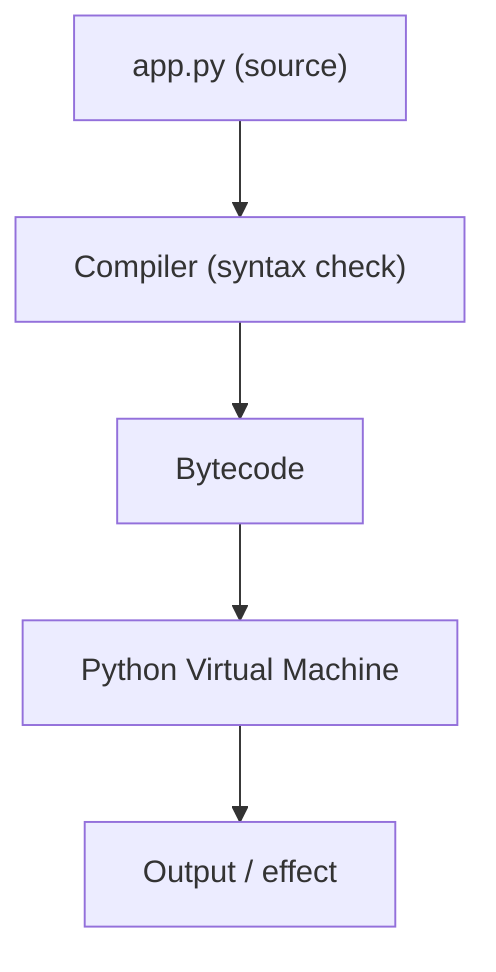

# Session 1: Python Introduction & Environment Setup

**Duration:** 30 minutes (keep live teaching to **running code + I/O**; long install and deep PVM are **appendix**.)  
**Type:** 📚 Knowledge  
**Level:** Noob → Nerd

---

## Outcome: “I made the computer talk to me”

The session is “about Python,” but the **feeling** you want is: **I ran something, and the machine responded**—and later, **I typed back, and it used what I said.**

> **Mental model (one line, repeat often):** *Python reads your program from **top to bottom** and runs it **one step at a time**.*  
> That line prevents a lot of confusion before Session 4 (conditionals) and beyond.

### What you’ll do today

- ✅ Run a first program and see output
- ✅ Use the **REPL** for quick experiments
- ✅ Run **scripts** (`01_hello.py`, `02_interactive_hello.py`) from a file
- ✅ Optionally peek at **bytecode** (don’t over-explain; curiosity is enough)
- ✅ See that **`input()` gives you text**—**Session 2** names this properly (variables and types)

### Suggested 30-minute flow (live)

| Time | Focus |
| ---- | ----- |
| 0–3 min | **Hook** — one `print`, then “how does that work?” |
| 3–12 min | **REPL** — math, `print`, optional `name = input` |
| 12–22 min | **Scripts** — `01_hello.py` then `02_interactive_hello.py` |
| 22–27 min | **Under the hood (short)** — source → bytecode → PVM; optional `bytecode_demo.py` |
| 27–30 min | **Close** — “what you can do now” + next session tease |

---

## 🪝 Opening hook: your first program

Start here—not with a long install lecture.

```python
print("Hello, World!")
```

Run it (REPL or a one-line file). **You just told the computer to do something.**

Now the real question: **How does that line turn into something that runs?** The rest of the session answers that in **small pieces**, after you have **touched the machine**.

> **Instructor (delivery):** use **predict → run** (“What will this print?”), then run. For `input`, ask: “**What do you think `type(age)` is after you type 25?**” Pause—then run `type(age)`.

---

## Before you begin

- Computer with [Python 3.13+](https://www.python.org/downloads/) installed (see **Appendix** if you need full steps).
- A terminal (PowerShell on Windows is fine) and, if you use it, an editor (e.g. VS Code).
- No prior programming experience required.

**Minimum check in class:**

```powershell
python --version
```

You should see a `3.13.x` (or at least 3.12+). If not, use **Appendix: Environment setup** before the hands-on.

---

## 💬 The REPL first: instant feedback, zero file friction

The **REPL** (Read–Eval–Print–Loop) is “talk to Python live.”

```powershell
python
```

At the `>>>` prompt, try (short set—enough to feel the loop):

```python
>>> 5 + 3
8
>>> print("Hello, Python!")
Hello, Python!
>>> name = "Python"
>>> print(f"Hello, {name}!")
```

**Why before long theory:** students see *cause and effect* immediately. Save deep `help()` tours for homework or the appendix; in 30 minutes, a single `help(print)` in the REPL is plenty if you need it.

---

## 🐍 What is Python? (two minutes, not a catalog)

Python is a **general-purpose** language: readable syntax, large ecosystem, used from teaching to data to web to automation. You are not choosing a career path in this block—you are **getting a computer to run your words**. The “why Python” list stays short so time stays in the **editor and terminal**.

---

## 🚀 Hands-on: run your first scripts (core of the session)

**Location in this repo:** `src/L1/S1/`  
**Files:** `01_hello.py`, `02_interactive_hello.py`, `bytecode_demo.py` (optional)

### 1) `01_hello.py` — output and comments

- Open `src/L1/S1/01_hello.py` in your editor, run with **Run Python File** or:

```powershell
cd path\to\repo\src\L1\S1
python 01_hello.py
```

- Notice: **statements run in order**; comments are for humans, not the machine.

The source file in the repository is the source of truth (the doc does not duplicate every line).

### 2) `02_interactive_hello.py` — input, f-strings, `type()`

- Run the script. Enter a name and an “age.”
- The script will stress: **even digits you type in `input()` are strings** until you convert (Session 2: `int()`, variables, data types in depth).
- **Predict → run:** *Before* showing `type(age)`, ask what type learners expect.

### 3) `bytecode_demo.py` — optional; don’t “teach the disassembly”

- This file shows bytecode with `dis`. **How to use it in the room:** “This is what happens *behind the scenes*. It’s OK if it’s fuzzy; the important idea is in the next section.”
- If time is short, **skip** running it; assign it as a curiosity read.

---

## Under the hood (after you have run code): source → bytecode → PVM

Now that you’ve *run* something, a **compressed** picture fits:

1. You write **source** (`.py`).
2. Python’s machinery turns that into **bytecode** (an intermediate form).
3. The **Python Virtual Machine (PVM)** runs that bytecode on your computer.

**One line for learners:** *Your code compiles to bytecode, then the PVM runs it—you usually don’t manage those steps by hand.*

### Diagram (optional slide)




For more detail, optional `compileall` and manual compile notes live in the **Appendix**—**not** in the live 30 minutes.

---

## Key takeaways (short)

- **print / input / f-strings / type** at a starter level; **`input` returns text** (Strings matter next session).
- **Execution model:** top to bottom, one step at a time.
- **REPL** for quick tries; **`.py` files** for “real” little programs.
- **Bytecode / PVM:** one idea, not a second course inside Session 1.

---

## What you can do now

You can now:

- Run Python in the **REPL** and in **files**
- **Print** output and read **input** with `input()`
- Use **f-strings** to build messages with values in them
- Use `type()` to **inspect** what you got from `input()`
- **Say in one sentence** that Python runs your file **top to bottom**

That is enough to build small, interactive programs—and it sets up everything that follows.

---

## Next session (bridge)

**Right now:** you can take input, but you treat it loosely as “what the user typed.”

**Next ([Session 2: Variables & Data Types](02_S2.md)):** you **name** data with variables and learn **data types** and **conversion** (`int`, `str`, etc.) so programs can **store and use** input correctly.

---

## 📝 Quick reference (Session 1)

| Idea | Code |
| ---- | ---- |
| Output | `print("Hi")` |
| Input (always a string) | `name = input("Name? ")` |
| Format | `f"Hello, {name}!"` |
| Inspect | `type(name)` |

---

## Delivery (how pros run this session)

- **Replace monologue with questions:** e.g. “What will `type(age)` be?”
- **Predict → run** before showing output.
- **Don’t** spend the first ten minutes on installers—**Appendix** or pre-read.
- **Pause** after the hook; let “Hello, World!” land before the next file.

---

## Appendix A — Environment setup (if `python --version` fails)

1. Install from [python.org](https://www.python.org/) — use **3.13+** when possible.
2. On Windows, enable **“Add python.exe to PATH”** during install.
3. **VS Code** (optional for Session 1 but great): [code.visualstudio.com](https://code.visualstudio.com) + **Python** extension (Microsoft).
4. Verify in a *new* terminal:

```powershell
python --version
```

Extra checks (optional, not for day-one lecture):

```powershell
py -0p
pip --version
code --version
```

---

## Appendix B — REPL: more play, and `help()`

If you have time **outside** the 30 minutes:

- Explore `help()` and `help(print)`.


---

## Appendix C — `py_compile` and bytecode files

Optional habit for **syntax** checking:

```powershell
python -m py_compile src/L1/S1/01_hello.py
```

`compileall` for a whole tree is optional. Session 1 does not require it.

---

## 🔧 Troubleshooting (short)

| Symptom | What to try |
| ------- | ----------- |
| `python` not found | Reinstall with PATH; open a new terminal. |
| VS Code wrong interpreter | `Ctrl+Shift+P` → **Python: Select Interpreter**. |
| Script won’t run | `cd` to the folder, check `.py` name, `python yourfile.py`. |

---

**Session 1 complete** — you can make the computer **respond** and you have a place to build from in Session 2.
