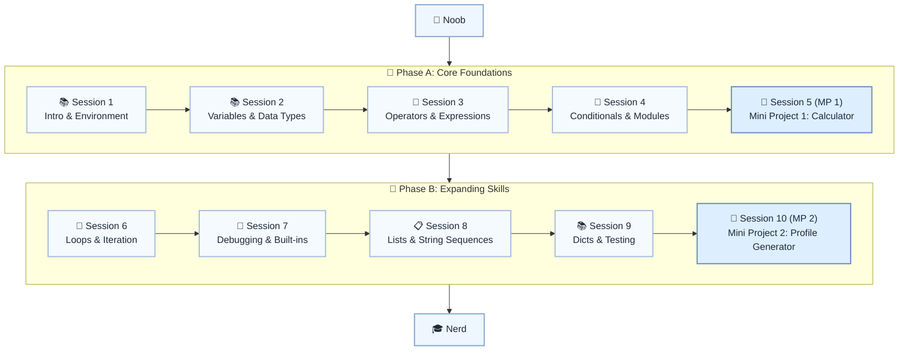

# 🐍 Level 1: Noob → Nerd — Python Fundamentals

## From clueless to curious: Your first exposure to Python programming

> **Stage:** Part 1 — Python Fundamentals (Levels 1–6) · **Program:** [Python Software Engineering Journey](../../01_Python-Fundamentals-MasterPlan.md)
>
> 1. **Level:** Noob → Nerd *(first exposure, installing Python, printing output)*
> 1. **Format:** 2 phases × (4 sessions + 1 mini project) = 10 sessions total
> 1. **Outcome:** 2 Mini Projects to cement your foundation
> 1. **Core guided time:** ~5–6 hours (8 × 30 min + 2 × 30–45 min MPs) — optional S6/S8 drills add practice time

## Powered by ShyvnTech & Swamy's Tech Skills Academy

> **Transformation Focus:** This is not only syntax — it is evolving your mindset from complete beginner to someone genuinely curious about programming.

### Level 1 status (three axes)

| Axis | Status |
| --- | --- |
| **Curriculum** | Validated — session docs + practice files complete |
| **Delivery** | S1–S5 completed · S6 published · S7–S8 planned · S9–S10 pending ([meetup table](../../meetup/L1/sessions.md)) |
| **Repository** | Implemented — `src/L1/S1` through `S10` |

---

## 🎯 **Level 1 Learning Path (Noob → Nerd)**

| Phase | Session | Topic                                                  | Duration  | Type         | Curriculum | Delivery   |
| ----- | ------- | ------------------------------------------------------ | --------- | ------------ | ---------- | ---------- |
| A     | 1       | Python Introduction, Environment & Built-in Functions  | 30 min    | 📚 Knowledge | Validated  | Completed  |
| A     | 2       | Variables & Data Types                                 | 30 min    | 📚 Knowledge | Validated  | Completed  |
| A     | 3       | Operators & Expressions                                | 30 min    | 📚 Knowledge | Validated  | Completed  |
| A     | 4       | Conditionals, Indentation & Introduction to Modules    | 30 min    | 📚 Knowledge | Validated  | Completed  |
| A     | 5 (MP 1) | Mini Project 1: Simple Calculator *(after Session 4)*  | 30–45 min | 🛠️ Project   | Validated  | Completed  |
| B     | 6       | Loops & Iteration                                      | 30 min    | 📚 Knowledge | Validated  | Ready      |
| B     | 7       | Basic Debugging, Reading Errors & Built-in Functions   | 30 min    | 📚 Knowledge | Validated  | Planned    |
| B     | 8       | Lists, Iteration & String Sequences                    | 30 min    | 📚 Knowledge | Validated  | Planned    |
| B     | 9       | Dictionaries & Basic Testing                           | 30 min    | 📚 Knowledge | Validated  | Pending    |
| B     | 10 (MP 2) | Mini Project 2: Personal Profile Generator *(after Session 9)* | 30–45 min | 🛠️ Project   | Validated  | Pending    |

---

## 🗺️ **Visual Roadmap**



ASCII fallback:

```text
[🎯 Noob]
    |
    v
[📘 Phase A: Core Foundations]
    ├─ [📚 Session 1: Intro & Environment]
    ├─ [📚 Session 2: Variables & Data Types]
    ├─ [🔢 Session 3: Operators & Expressions]
    ├─ [🤔 Session 4: Conditionals & Modules]
    └─ [🚀 Session 5 (MP 1): Mini Project 1: Calculator]
    |
    v
[📘 Phase B: Expanding Skills]
    ├─ [🔄 Session 6: Loops & Iteration]
    ├─ [🐛 Session 7: Debugging & Built-ins]
    ├─ [📋 Session 8: Lists & String Sequences]
    ├─ [📚 Session 9: Dicts & Testing]
    └─ [🚀 Session 10 (MP 2): Mini Project 2: Profile Generator]
    |
    v
[🎓 Nerd]
```

---

## 📅 **Phase A: Core Foundations + Mini Project 1**

### ✅ Session 1: Python Introduction & Environment Setup

* What is Python? History, usage, job market
* Installing Python 3.13+ and VS Code
* Understanding Python execution (PVM explanation)
* Python Interactive Shell (REPL) exploration
* Built-in functions: `print()`, `input()`, `type()`, `help()`, f-strings
* Your first scripts: From "Hello World" to interaction
* Introduction to comments

🧪 *Practice Files*:  
`src/L1/S1/01_hello.py`, `src/L1/S1/02_interactive_hello.py`, `src/L1/S1/bytecode_demo.py`

📖 *Documentation*: [S1.md](S1.md)

---

### ✅ Session 2: Variables & Data Types

* Variable naming conventions and assignment
* Data types: `int`, `float`, `str`, `bool`
* Dynamic typing, `type()`, `isinstance()`
* Type conversion and casting
* Optional bridge: values as objects (`type()` inspects objects; full OOP in L3)

🧪 *Practice Files*:  
`src/L1/S2/01_variables.py`, `src/L1/S2/02_data_types.py`, `src/L1/S2/03_type_conversion.py`

📖 *Documentation*: [S2.md](S2.md)

🧪 *Mini Practice*: Store and display personal details with different data types.  
📌 *Feeds into Mini Project 1*: User input and storage are core to the calculator.

---

### ✅ Session 3: Operators & Expressions

* Arithmetic operators: `+`, `-`, `*`, `/`, `//`, `%`, `**`
* Comparison operators: `==`, `!=`, `<`, `>`, `<=`, `>=`
* Assignment operators: `=`, `+=`, `-=`, etc.
* Operator precedence and parentheses

🧪 *Practice Files*:  
`src/L1/S3/01_arithmetic.py`, `src/L1/S3/02_comparisons.py`, `src/L1/S3/03_mini_calculator.py`

📖 *Documentation*: [S3.md](S3.md)

🧪 *Mini Practice*: Build a basic calculator with different operations.  
📌 *Feeds into Mini Project 1*: Calculator logic.

---

### ✅ Session 4: Conditional Statements, Indentation & Modules

* Python indentation rules (why no braces)
* `if`, `elif`, `else` statements
* Boolean logic: `and`, `or`, `not`
* Built-in functions vs modules
* Importing modules (`import`, `from...import`)
* `random` module: random numbers, choices, shuffling

🧪 *Practice Files*:  
`src/L1/S4/01_conditionals.py`, `src/L1/S4/02_boolean_logic.py`, `src/L1/S4/03_number_guessing_game.py`

📖 *Documentation*: [S4.md](S4.md)

🧪 *Mini Practice*: Build a number guessing game using conditionals + `random`.  
📌 *Feeds into Mini Project 1*: Conditional checks & input handling.

---

### 🚀 Mini Project 1: Simple Calculator *(Validated · delivery: Completed)*

**Goal:** Build a command-line calculator for basic arithmetic.

**Features:**

* Addition, subtraction, multiplication, division
* User-friendly input handling
* Input validation
* One-run calculator flow (single calculation per execution)
* Clean, structured code
* **PEP 8 introduction** (naming, spacing, comments) — *spiral: reinforced in Session 7*

🧪 *Practice Pack*: `src/L1/S5/01_PEP8_naming_and_spacing.py`, `src/L1/S5/02_del_and_bool_arithmetic.py`, `src/L1/S5/03_simple_calculator.py`, `src/L1/S5/calculator_utils.py`
📖 *Project Guide*: [S5.md](S5.md)

🎯 *Stretch Goals*:

* Add power (`**`) and square root
* Add a memory function to store last result

---

## 📅 **Phase B: Expanding Skills + Mini Project 2**

### ✅ Session 6: Loops & Iteration *(Validated · delivery: Published)*

* `for` loops with `range()` and iterables
* `while` loops and loop conditions
* Loop controls: `break`, `continue`, `pass`
* Nested loops and performance considerations

🧪 *Practice Files*:  
`src/L1/S6/01_for_loops.py`, `src/L1/S6/02_while_loops.py`, `src/L1/S6/03_loop_controls_fizzbuzz.py`, `src/L1/S6/04_calculator_loop.py`, `src/L1/S6/05_values_to_variables.py`, `src/L1/S6/06_chained_and_multi_assignment.py`, `src/L1/S6/07_conversion_limits.py`

Optional reinforcement (boolean precedence & truthy/falsy):  
`src/L1/S6/08_boolean_logic_precedence.py`, `src/L1/S6/09_non_bool_values.py`

📖 *Documentation*: [S6.md](S6.md)

🧪 *Mini Practice*: FizzBuzz challenge, countdown timer, pattern printing.  
📌 *Feeds into Mini Project 2*: Looping over profiles.

---

### ✅ Session 7: Basic Debugging & Built-in Functions *(Validated · delivery: Planned)*

* Error types: syntax vs runtime
* Reading error messages
* Common beginner mistakes
* Debugging with `print()`
* Built-in functions: `len()`, `max()`, `min()`, `sum()`, `abs()`, `round()`
* **PEP 8 reinforcement** (warm-up — full intro was in MP1)

🧪 *Practice Files*:  
`src/L1/S7/01_error_examples.py`, `src/L1/S7/02_debug_practice.py`, `src/L1/S7/03_builtin_functions.py`, `src/L1/S7/04_pep8_style_refactor.py`, `src/L1/S7/05_pep8_indentation.py`, `src/L1/S7/06_print_sep_end.py`, `src/L1/S7/07_escape_sequences.py`

📖 *Documentation*: [S7.md](S7.md)

🧪 *Mini Practice*: Debug broken code samples.  
📌 *Feeds into Mini Project 2*: Debugging profile input.

---

### ✅ Session 8: Lists, Iteration & String Sequences *(Validated · delivery: Planned)*

**Core (30-minute session):**

* List creation, indexing, nested indexing, slicing, and tuple-to-list conversion
* Operations: `append()`, `remove()`, `len()`, slice replacement, and accessing elements
* Iteration with lists
* Practical list usage: filtering, modifying, building from user input

🧪 *Core practice files*:  
`src/L1/S8/01_list_basics.py`, `src/L1/S8/02_list_methods.py`, `src/L1/S8/03_task_manager.py`

Optional reinforcement — **Strings as Sequences** (run before or after core):  
`src/L1/S8/04_string_basics.py`, `src/L1/S8/05_string_len.py`, `src/L1/S8/06_string_methods.py`, `src/L1/S8/07_string_replace.py`, `src/L1/S8/08_string_case_methods.py`, `src/L1/S8/09_string_strip_methods.py`, `src/L1/S8/10_string_indexing_and_slicing.py`, `src/L1/S8/11_string_format_method.py`, `src/L1/S8/12_f_strings.py`, `src/L1/S8/16_percent_formatting.py`

Optional reinforcement — **List method drills**:  
`src/L1/S8/13_list_append_remove.py`, `src/L1/S8/14_list_insert_pop.py`, `src/L1/S8/15_list_sort_reverse.py`

📖 *Documentation*: [S8.md](S8.md)

🧪 *Mini Practice*: Task list manager with lists + loops.  
📌 *Feeds into Mini Project 2*: Storing multiple hobbies or goals.

---

### ✅ Session 9: Dictionaries & Basic Testing *(Validated · delivery: Pending)*

* Dictionaries: creation, update, deletion
* Methods: `.keys()`, `.values()`, `.items()`, `.get()`
* Iterating over dictionaries
* Why testing matters
* Manual testing vs using `assert`

🧪 *Practice Files*:  
`src/L1/S9/01_dict_basics.py`, `src/L1/S9/02_dict_iteration.py`, `src/L1/S9/03_gradebook.py`

📖 *Documentation*: [S9.md](S9.md)

🧪 *Mini Practice*: Student gradebook with dictionaries + asserts.  
📌 *Feeds into Mini Project 2*: User profiles as dictionaries + validation.

---

### 🚀 Mini Project 2: Personal Profile Generator *(Validated · delivery: Pending)*

**Goal:** Create an interactive profile generator and display system.

**Features:**

* Collect user info (name, age, hobbies, goals)
* Store in dictionaries + lists
* Display formatted profile
* Handle multiple profiles
* Basic input validation

🧪 *Deliverable*: `src/L1/S10/profile_generator.py`  
📖 *Project Guide*: [S10.md](S10.md)

📌 *Bridge to Level 3:* Profile Generator is a **refactor target** for L3 MP1 (object-based profile manager).

🎯 *Stretch Goals*:

* Export profile to JSON file
* Allow search/filter by name
* Add “edit profile” option

---

## 🎓 **Level 1 Learning Outcomes**

By completing Level 1, you will:

* ✅ Set up Python environment confidently
* ✅ Write & run first Python scripts
* ✅ Use built-in functions effectively
* ✅ Work with variables, operators, and conditionals
* ✅ Control program flow with loops
* ✅ Apply PEP 8 habits (introduced in MP1, reinforced in S7)
* ✅ Debug errors using messages and print statements
* ✅ Store/manipulate data using lists & dictionaries
* ✅ Apply basic testing with asserts
* ✅ Complete 2 mini projects showing your skills
* ✅ Be ready for **Level 2: Nerd → Novice**

### Exit criteria (before Level 2)

* ✅ Write a Python script using variables, conditionals, and loops without syntax errors
* ✅ Read and understand basic error messages (NameError, TypeError, IndentationError)
* ✅ Use lists and dictionaries to store and retrieve data
* ✅ Use `assert` for simple manual checks
* ✅ Explain why Python uses indentation instead of braces

### Common anti-patterns (Level 1)

* ❌ **Copy-paste without understanding** — explain each line before running
* ❌ **Ignoring error messages** — read tracebacks bottom-up
* ❌ **Magic numbers everywhere** — name values with clear variables
* ❌ **No `# Why:` comments** on non-obvious decisions

### Reflection (Level 1)

* What surprised you about Python's indentation or `input()` always returning strings?
* What debugging habit will you keep after Session 7?
* Which optional S8 drill helped most — lists or strings?

---

## 📊 **Assessment Criteria**

* **Phase A**: Can install Python, work with variables, operators, and conditionals → Complete Calculator Project
* **Phase B**: Can debug, work with loops, lists, and dictionaries → Complete Profile Generator Project

**Mini Project Success Indicators:**

* Calculator works with all four operations, validates input, and handles divide-by-zero safely.
* Profile generator collects + displays user data, supports multiple profiles, validates inputs.

---

## 🎓 **Next Steps & Resources**

After Level 1, you’re ready to explore:

* Functions & modular programming
* File handling
* Error handling (exceptions)
* Advanced data structures

**Tools Recommended:**

* Python 3.13+
* VS Code with Python extension
* Git for version control
* (Optional) Jupyter Notebook, PyCharm, Replit

---

✨ Happy Coding! 🐍
